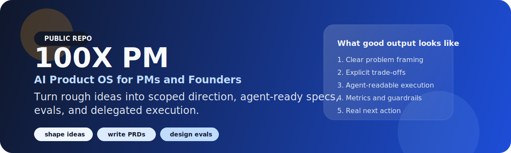

<p align="center">
  
</p>

# 100X PM

<p align="center"><strong>AI Product OS for PMs and Founders</strong></p>
<p align="center">Turn rough ideas into product direction, business model, channel strategy, and agent-ready execution.</p>
<p align="center"><strong>Scrape the market. Simulate the users. Compile the strategy.</strong></p>

<p align="center">
  
  
  
  
</p>

> 100X PM is not about writing faster. It is about turning ambiguity into product direction, business logic, channel choices, and executable operating plans.

中文一句话：  
**100X PM 不是让 AI 更会写，而是让 PM 和 founder 更快把模糊问题收敛成可落地的判断与执行。**

## Start Here

- [START_HERE.md](START_HERE.md)
- [INSTALL.md](INSTALL.md)
- [MUST_INSTALL.md](MUST_INSTALL.md)
- [PACKS.md](PACKS.md)
- [PRINCIPLES.md](PRINCIPLES.md)
- [docs/core-sell-points.md](docs/core-sell-points.md)
- [docs/front-door-e2e-validation.md](docs/front-door-e2e-validation.md)

## Fastest Path

If you only remember one path, remember this:

1. start at [pm-command-center](commands/pm-command-center.md) if you need routing
2. run [find-winning-direction](commands/find-winning-direction.md) if you already have a URL, a rough idea, or messy strategy context
3. move into `validate-demand`, `agent-prd`, and `run-roadmap` once the direction is sharp

## Meet Lighty

**Lighty** is the mascot-guide for 100X PM.

Lighty routes every session into one of three modes:

1. **Audit a product**: start from a website, app, or existing product
2. **Shape a new idea**: start from a rough founder or PM concept
3. **Build long-range vision**: start from messy docs, notes, and fragmented context

Lighty is not just visual branding. Lighty represents the core 100X PM loop:

- gather messy context
- scrape public signals with `Scrapling`
- build persona and market-twin inputs
- simulate reactions with `OASIS`
- compile the answer into strategy, PRDs, roadmaps, and delegated execution

## One Engine, Three Entry Modes

100X PM should be understood as **one strategy engine**, not three disconnected tools.

All three modes reuse the same chain:

```text
signal harvesting -> persona / market twin -> OASIS simulation
-> strategy synthesis -> PRD / roadmap / agent handoff
```

The three entry modes are:

| Entry mode | Best starting input | What it optimizes for |
| --- | --- | --- |
| **Audit a product** | website, app, product, reviews, support logs | hidden pain points, stronger hypotheses, sharper product bets |
| **Shape a new idea** | rough idea, founder instinct, early thesis | wedge, business model, first channel, first execution plan |
| **Build long-range vision** | scattered docs, strategy notes, roadmap sprawl | 3-5 year direction, phased roadmap, strategic narrative |

## Hero Flow

The launch hero path is **Audit a product**.

Why:

- the input is concrete
- the output is easy to judge
- it makes the OASIS + Scrapling story visible fast
- it is the easiest public demo to understand

The second path is **Shape a new idea**.

The third path is **Build long-range vision**.

## Three Ways To Use 100X PM

| Mode | Typical input | What 100X PM does | Output |
| --- | --- | --- | --- |
| Audit a product | website URL, app, reviews, support logs, market chatter | scrape signals, generate hypotheses, simulate reactions, identify hidden pain points and leverage | product bets, pain point memo, business model moves, execution path |
| Shape a new idea | rough startup idea, founder instinct, early market thesis | narrow to a wedge, design the business model, pick the first channel, pressure-test the narrative | winning direction, strategic story, first PRD, first roadmap |
| Build long-range vision | internal docs, strategy notes, roadmap sprawl, fragmented market context | compress chaos into a 3-5 year direction and phased roadmap | long-range vision, capability map, phased roadmap, strategic narrative |

## What You Can Do Today

| If your situation looks like this | Run this | Expected output |
| --- | --- | --- |
| I have a website, product, or app and want hidden pain points plus stronger strategic bets | [find-winning-direction](commands/find-winning-direction.md) | pain point map, hypothesis set, business model moves, channel bets, and next execution path |
| I have a rough idea and need the founder version of "what should we build and how does it win?" | [find-winning-direction](commands/find-winning-direction.md) | wedge, business model, channel, narrative, risks, and next execution path |
| I have too much product context and need a sharper 3-5 year direction | [find-winning-direction](commands/find-winning-direction.md) | direction options, long-range narrative, phased roadmap, and strategic risks |
| I only have a rough idea | [shape-idea](commands/shape-idea.md) | 2-3 scoped directions, a recommended wedge, risks, and first move |
| I need to know if demand is real | [validate-demand](commands/validate-demand.md) | evidence-backed demand memo |
| I need a spec humans and agents can execute | [agent-prd](commands/agent-prd.md) | dual-mode PRD with constraints and review rules |
| I need to decide what wins now vs later | [prioritize](commands/prioritize.md) | ranked decision with explicit trade-offs |
| I am shipping an AI feature | [design-eval](commands/design-eval.md) | pass/fail logic, red flags, fallback, and review triggers |
| I need to turn direction into execution | [run-roadmap](commands/run-roadmap.md) | milestones, ownership, dependencies, and tracking cadence |
| I do not know where to start | [pm-command-center](commands/pm-command-center.md) | routed next command and shortest path |

## Install In 2 Minutes

```bash
git clone https://github.com/Johnnnmai/100x-product-manager.git
cd 100x-product-manager
```

Use one of these prompt patterns:

```text
Using commands/find-winning-direction.md with Lighty:
Run the command exactly.
Tell me whether this is product audit mode, new idea mode, or long-range vision mode.
Make assumptions explicit.
Use market signals first, then simulate user reactions if useful.
Give me the product wedge, business model, launch channel, strategic narrative, and the next command.
```

Platform guides:

- [Using 100X PM with Claude](docs/Using%20PM%20Skills%20with%20Claude.md)
- [Using 100X PM with Codex](docs/Using%20PM%20Skills%20with%20Codex.md)
- [Using 100X PM with ChatGPT](docs/Using%20PM%20Skills%20with%20ChatGPT.md)

## 11 Public Commands

1. `pm-command-center`
2. `find-winning-direction`
3. `shape-idea`
4. `validate-demand`
5. `agent-prd`
6. `prioritize`
7. `define-metrics`
8. `design-experiment`
9. `design-eval`
10. `run-roadmap`
11. `make-content`

Full details live in [MUST_INSTALL.md](MUST_INSTALL.md).

## Why This Repo Exists

Most PM + AI repos stop at "write better prompts."

100X PM is built around a stronger claim:

- average PM work gets stuck in ambiguity, weak prioritization, noisy demand, and unclear success
- top PM work is nonlinear because it converges faster, wastes less work, and turns decisions into operating systems
- AI matters when it shapes direction, defines behavior, and splits execution, not when it only drafts text

If you want the short version:

**This is not a loose prompt library. It is a public operating system for turning idea -> direction -> business model -> channel -> evidence -> scope -> spec -> metrics -> eval -> roadmap -> delegated execution.**

## Why This System Wins

The differentiated layer is not just prompting. It is the combination of:

- **`Scrapling`** for public web, review, and social signals
- **persona / market-twin building** for simulation-ready profiles
- **`OASIS`** for persona and market-reaction simulation
- **`MiroFish`** for higher-fidelity digital-twin style reporting when advanced setup is available

This gives 100X PM stronger raw material than a normal PM prompt workflow:

- what users say in public
- what target personas are likely to object to
- what wedge is strong enough to support a business model
- what belongs in strategy vs. what belongs in execution

The product story should be read as:

**Scrape the market -> simulate the users -> compile the strategy -> hand execution to humans or agents.**

## Proof Of Value

We are not publishing invented homepage metrics. We are publishing inspectable artifacts.

### Live proof layers

| Proof layer | What it compares | Status |
| --- | --- | --- |
| Before/after artifacts | same input, plain prompt vs command-guided output | live |
| Pilot benchmark wave 1 | same-model baseline vs 100X PM on 4 canonical tasks | live |
| Front-door E2E pilot wave 2 | same-model baseline vs 100X PM across audit, idea, and vision modes | live |
| Blind-scored benchmark | reviewer-blinded scoring across canonical tasks | planned |

Wave 2 headline:
across audit, idea, and vision modes, the command-guided workflow improved average quality by `+2.13`, reduced time to acceptable draft by `43.1%`, and reduced manual edits by `61.1%`.

### Before / after examples

- [PRD before/after](examples/before-after/prd-before-after.md)
- [Prioritization before/after](examples/before-after/prioritization-before-after.md)
- [AI eval before/after](examples/before-after/eval-before-after.md)

### Pilot benchmark wave 1

Wave 1 is a same-model, single-operator pilot. It is public because the raw prompts, outputs, and scorecards are in the repo. It is not yet blinded.

| Task | Baseline avg | 100X PM avg | Delta | Time to acceptable draft | Summary |
| --- | --- | --- | --- | --- | --- |
| `shape-idea` | 2.3/5 | 4.1/5 | +1.8 | 18 min -> 10 min | [run](examples/value-tests/runs/2026-03-10-shape-idea-summary.md) |
| `agent-prd` | 2.9/5 | 4.4/5 | +1.5 | 25 min -> 14 min | [run](examples/value-tests/runs/2026-03-10-agent-prd-summary.md) |
| `prioritize` | 3.0/5 | 4.3/5 | +1.3 | 16 min -> 9 min | [run](examples/value-tests/runs/2026-03-10-prioritize-summary.md) |
| `design-eval` | 2.1/5 | 4.4/5 | +2.3 | 20 min -> 11 min | [run](examples/value-tests/runs/2026-03-10-design-eval-summary.md) |

Full benchmark package:

- [Value test plan](docs/value-test-plan.md)
- [Wave 1 summary](examples/value-tests/runs/2026-03-10-wave-1-summary.md)
- [Wave 2 front-door summary](examples/value-tests/runs/2026-03-11-wave-2-front-door-summary.md)
- [Scorecard template](examples/value-tests/scorecard-template.md)
- [Task run template](examples/value-tests/task-run-template.md)
- Recompute wave metrics:
  `python scripts/verify-value-test-wave.py "examples/value-tests/runs/2026-03-11-find-winning-direction-*-scorecard.md"`

## Repo Layout

- `commands/`: the public front door
- `skills/`: the reusable execution layer behind commands
- `packs/`: grouped operating paths for common PM jobs
- `examples/`: before/after artifacts and benchmark runs
- `docs/`: setup, usage, and operating guidance
- `app/`: Streamlit beta playground

## Packs

This repo is organized around practical packs, not a random skill supermarket.

- [Direction & Discovery](PACKS.md#direction--discovery)
- [Demand & Insights](PACKS.md#demand--insights)
- [PRD & Scope](PACKS.md#prd--scope)
- [Metrics & Experiments](PACKS.md#metrics--experiments)
- [AI PM & Evals](PACKS.md#ai-pm--evals)
- [Roadmaps & Delegation](PACKS.md#roadmaps--delegation)
- [Career & Interviews](PACKS.md#career--interviews)
- [Content & Distribution](PACKS.md#content--distribution)

## System Layers

These layers define the system architecture, even when some of them are optional at local runtime:

- `Scrapling`: web evidence ingestion, social signals, and product-audit research
- persona / market-twin building: simulation-ready user profiles
- `OASIS`: the simulation layer for market-twin and persona-reaction testing
- `MiroFish`: the higher-fidelity reporting and digital-twin strategy lab layer
- `Context Hub`: curated external context and versioned knowledge
- `Paperclip`: orchestration layer for business goals and agent assignment
- `claude-mem`: working memory and context compression

## License

CC BY-NC-SA 4.0
